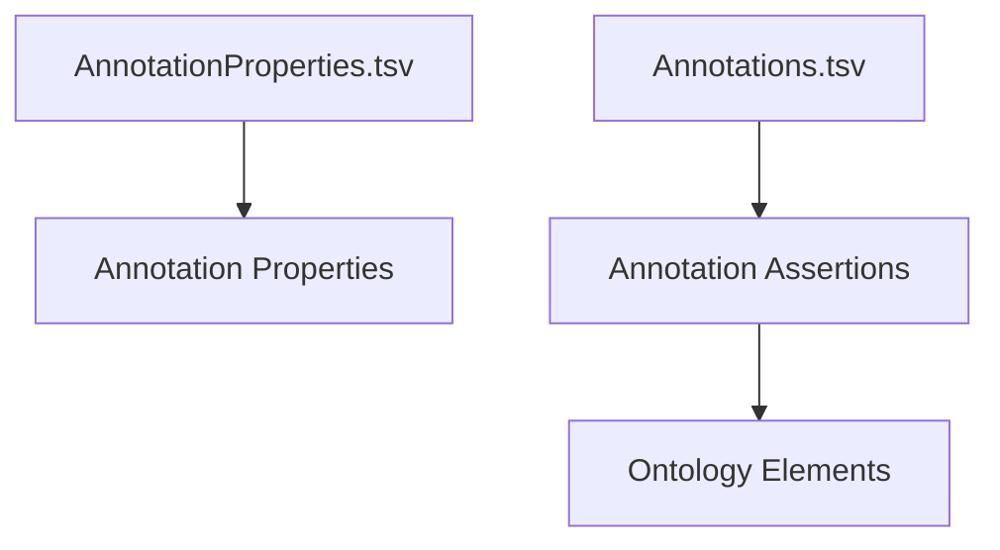

# Annotations – Complete Specification

Annotations in **uml2semantics** provide a structured mechanism for attaching **governance metadata**, documentation, quality indicators, provenance, lifecycle information, stewardship roles, and ISO-aligned semantic labels to ontology entities.

The annotation system is fully declarative and driven by two TSV files:

1. `AnnotationProperties.tsv` – defines annotation vocabulary  
2. `Annotations.tsv` – applies annotation assertions to ontology elements  

Both files integrate seamlessly with classes, properties, datatypes, individuals, and the ontology itself.

---

# 1. Purpose of the Annotation System

Annotations allow you to enrich your ontology with metadata such as:

- natural language descriptions  
- governance tags (e.g. steward, owner, version, status)  
- provenance (e.g. source, importedFrom, creation date)  
- quality information  
- FAIR metadata  
- controlled vocabulary links  
- lifecycle states (draft, approved, deprecated)

uml2semantics ensures annotations are correctly serialised as OWL 2 annotation assertions in Turtle, RDF/XML, or JSON-LD.

---

# 2. AnnotationProperties.tsv – Defining Annotation Vocabulary

This TSV defines the **annotation properties** that can be used across the model.

## 2.1 Required Columns

| Column | Description |
|--------|-------------|
| **Curie** | CURIE for the annotation property, e.g. `dct:creator` |
| **Name** | Human-readable label |
| **Definition** | Description of the annotation property and its intended usage |

## 2.2 Example

```
Curie           Name         Definition
dct:creator     Creator      The person or system that created the entity.
dct:source      Source       Source data or upstream artefact.
iso:status      Status       Governance lifecycle label.
```

uml2semantics generates OWL axioms of the form:

```
AnnotationProperty: dct:creator
  Annotations: rdfs:label "Creator"
```

---

# 3. Annotations.tsv – Annotation Assertions

This TSV applies annotation assertions to classes, properties, datatypes, individuals, or the ontology itself.

## 3.1 Required Columns

| Column | Description |
|--------|-------------|
| **TargetCurie** | CURIE of entity being annotated |
| **AnnotationProperty** | CURIE referencing AnnotationProperties.tsv |
| **Value** | Literal string or IRI |
| **Language** | Optional language tag (ISO 639‑1) |
| **Datatype** | Optional literal datatype |

## 3.2 Value Interpretation Rules

- If **Datatype** is given, `Value` is treated as a typed literal.  
- If **Language** is given, `Value` is serialized as a language-tagged literal.  
- If neither is provided, `Value` is a plain string literal.  
- If `Value` begins with a registered prefix, it is interpreted as an **IRI**.

Examples:

| Value | Result |
|-------|--------|
| `"Account Transactions"` | plain literal |
| `"Account"` with language `en` | `"Account"@en` |
| `"2024-01-20"` with datatype `xsd:date` | `"2024-01-20"^^xsd:date` |
| `skos:Concept123` | IRI reference |

---

# 4. Example Annotation Usage

### Example Rows

```
TargetCurie    AnnotationProperty   Value                       Language   Datatype
iso:Account    rdfs:label           "Account"                   en
iso:Account    dct:source           "ISO 20022 Logical Model"
iso:Amount     iso:status           "approved"
iso:Amount     dct:creator          "Chris Day"
iso:Amount     dct:modified         "2025-02-10"                ""        xsd:date
iso:GBP        skos:prefLabel       "British Pound Sterling"    en
```

### Resulting OWL (Turtle)

```
iso:Account rdfs:label "Account"@en .
iso:Account dct:source "ISO 20022 Logical Model" .
iso:Amount iso:status "approved" .
iso:Amount dct:creator "Chris Day" .
iso:Amount dct:modified "2025-02-10"^^xsd:date .
iso:GBP skos:prefLabel "British Pound Sterling"@en .
```

---

# 5. Governance Metadata Examples

Annotations are ideal for recording:

### 5.1 Status Indicators
```
iso:status = draft | proposed | approved | deprecated
```

### 5.2 Stewardship
```
gov:steward = “Data Architecture Team”
gov:owner   = “Payments Domain Owner”
```

### 5.3 Provenance and Versioning
```
dct:source = “ISO 20022 2013 Edition”
dct:modified = “2024-10-02”
owl:versionInfo = “v2.3.1”
```

### 5.4 FAIR Metadata
```
fair:category   = “Interoperability”
fair:score      = “0.83”
```

---

# 6. Annotation Use Cases

### Use Case 1 – Semantic Documentation
Annotate entities with descriptive labels, domain definitions, glossary references.

### Use Case 2 – Data Governance
Track ownership, approval workflow, status, lifecycle.

### Use Case 3 – Provenance & Lineage
Record upstream systems, data sources, transformation authors.

### Use Case 4 – Compliance Metadata
Mark controlled classes, explain regulatory requirements.

### Use Case 5 – FAIR Enablement
Provide discovery, accessibility, interoperability and reusability metadata.

---

# 7. Best Practices

- Maintain a curated list of annotation properties.  
- Use one TSV row per annotation.  
- Prefer CURIE values over hardcoded IRIs.  
- Use typed literals for dates, numbers, and formal values.  
- Include natural language strings for human readability.  

---

# 8. Mermaid Diagram – Annotation Workflow



---

# 9. Next Steps

Continue to:

- [[CLI-Usage]] to learn how annotations integrate into CLI arguments  
- [[Datatypes-and-Facets]] for modelling constraints  
- [[Examples]] for practical TSV samples  

Return to [[Home]].
