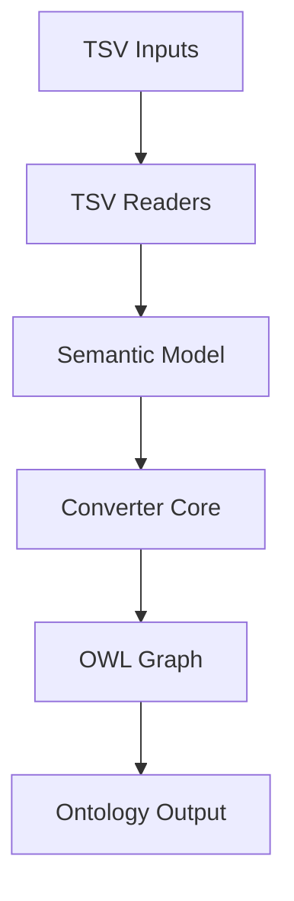
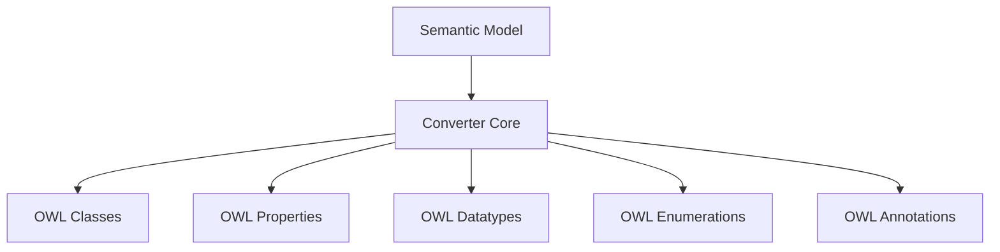
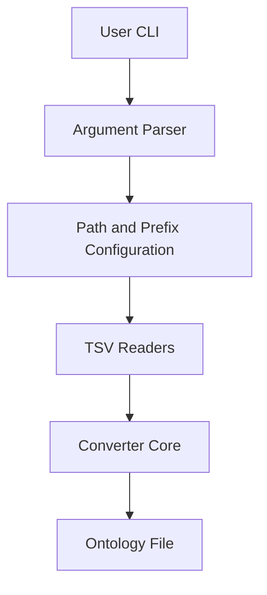
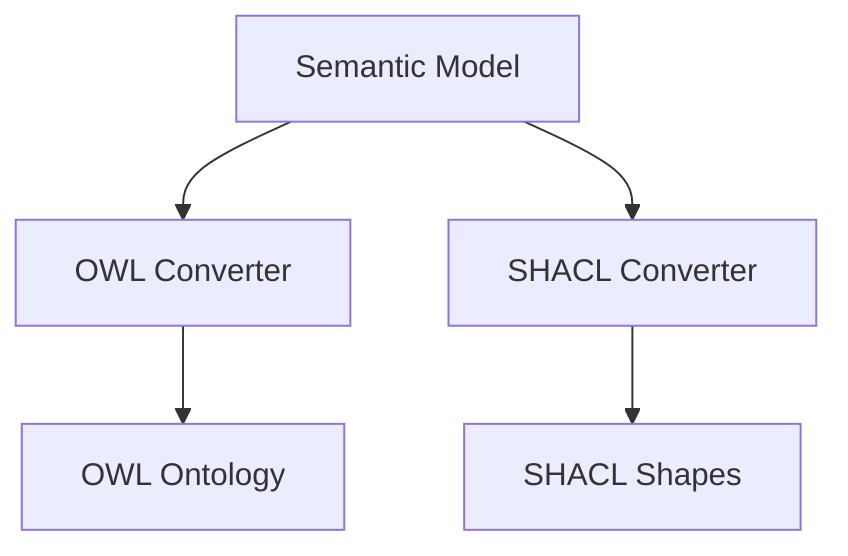

# Architecture – uml2semantics-python Detailed Overview

This document describes the **internal architecture** of `uml2semantics-python`, focusing on the main components, data flow, module responsibilities, and extension points. It is intended for developers who want to understand how TSV inputs are transformed into an OWL 2 ontology and where to plug in new behaviour.

All diagrams are GitHub safe and use Mermaid for visualising the pipeline.

---

# 1. High Level Architecture

At a high level, `uml2semantics` implements a **layered pipeline**:

1. **Input Layer** – TSV readers parse model definitions from text files.  
2. **Semantic Model Layer** – in memory structures representing classes, properties, datatypes, enumerations, annotations.  
3. **Converter Core** – applies deterministic mapping rules to build an OWL 2 graph.  
4. **Output Layer** – serialises the graph to Turtle, RDF/XML, JSON-LD, N-Triples, TriG, or N3.  
5. **CLI Layer** – exposes the converter as a command line tool with validation and diagnostics.  
6. **Examples and Tests** – ensure reproducible example models and golden outputs.

---

# 2. Major Components

## 2.1 TSV Readers

The TSV readers are responsible for:

- Reading UTF 8 tab separated files.  
- Validating mandatory fields where required (e.g., class and attribute names).  
- Normalising rows into internal structures.  
- Handling optional files gracefully when not provided.  

There is typically a dedicated reader per TSV category:

- Classes TSV reader  
- Attributes TSV reader  
- Datatypes TSV reader  
- Enumerations TSV reader  
- AnnotationProperties TSV reader  
- Annotations TSV reader  

Each reader converts raw rows into strongly typed records that the converter core can consume.

---

## 2.2 Semantic Model Layer

The semantic model layer acts as an **intermediate abstraction** between raw TSV rows and OWL constructs. Typical internal concepts include:

- Class descriptor  
- Attribute descriptor  
- Datatype descriptor  
- Enumeration descriptor  
- Enumeration value descriptor  
- Annotation property descriptor  
- Annotation assertion descriptor  

These descriptors capture:

- Identifiers and CURIEs  
- Labels and definitions  
- Parent child relationships  
- Choice semantics and members  
- Datatype facet information  
- Multiplicity constraints  
- Target information for annotations  

This separation allows the converter core to focus on mapping logic rather than raw file parsing.

---

## 2.3 Converter Core

The converter core is the heart of `uml2semantics`. It is responsible for:

- Creating an OWL ontology object and base IRI.  
- Registering namespace prefixes from CLI options.  
- Creating OWL classes from class descriptors.  
- Creating datatype and object properties from attribute descriptors.  
- Constructing named datatypes and restrictions from datatype descriptors.  
- Creating enumeration classes and individuals from enumeration descriptors.  
- Applying choice patterns as union plus disjoint axioms.  
- Applying multiplicity rules as cardinality and some values from restrictions.  
- Applying annotation properties and annotation assertions.  

The core is designed to be **deterministic**. Given the same TSV inputs and CLI arguments it must produce exactly the same ontology every time.

---

## 2.4 OWL Graph and Serialisation Layer

The converter core creates an in memory OWL graph using a standard RDF library. The graph is then serialised based on the requested file extension:

- `.ttl` -> Turtle  
- `.rdf` or `.owl` -> RDF XML  
- `.jsonld` -> JSON LD  
- `.nt` -> N Triples  

The same internal graph can be serialised to multiple formats without re running the conversion pipeline.

---

## 2.5 CLI Layer

The CLI layer provides the `uml2semantics` command. It is responsible for:

- Parsing command line arguments.  
- Validating required options.  
- Constructing the converter with the correct base IRI and prefixes.  
- Invoking the TSV readers in the correct order.  
- Passing descriptors to the converter core.  
- Handling exceptions and exit codes.  
- Printing diagnostics in debug modes.  

This layer is intentionally thin to keep business logic inside the converter core.

---

# 3. Data Flow Pipeline

This section walks through the **end to end data flow** once the user invokes the CLI.

## 3.1 Input Resolution

1. Expand and validate TSV file paths.  
2. Resolve prefixes from the `-p` option into a prefix map.  
3. Create an ontology IRI from `-i`.

## 3.2 Model Loading

4. Read **Classes.tsv** and create class descriptors.  
5. Read **Datatypes.tsv** and create datatype descriptors.  
6. Read **Enumerations.tsv** and **EnumerationNamedValues.tsv** if present.  
7. Read **Attributes.tsv** and attach attribute descriptors to their owning classes.  
8. Read **AnnotationProperties.tsv** and create annotation property descriptors.  
9. Read **Annotations.tsv** and create annotation assertion descriptors.

## 3.3 Conversion

10. Create an OWL ontology and register prefixes.  
11. Materialise classes and class hierarchies.  
12. Materialise named datatypes and restrictions.  
13. Materialise enumeration classes and individuals.  
14. Materialise properties and multiplicity restrictions.  
15. Apply choice patterns as union and disjointness axioms.  
16. Attach annotations to ontology, classes, properties, datatypes, individuals.  

## 3.4 Serialisation

17. Serialise the ontology graph to the requested format and write the output file.  

---

# 4. Error Handling and Validation

The architecture supports several layers of validation:

## 4.1 TSV Level Validation

- Required fields enforced for classes, attributes, and enumerations.  
- Basic parsing of multiplicities and numeric facet columns.  

## 4.2 Semantic Model Validation

- Duplicate or missing identifiers are rejected.  
- Attribute types must resolve to classes, enumerations, named datatypes, or `xsd:` primitives.  
- Cardinality constraints must be consistent.  
- Missing prefixes and unresolved choice members are reported as warnings.  

## 4.3 Ontology Level Validation

- Optional stricter behavior (`--strict`) promotes validation warnings to errors.

Errors are typically raised as exceptions, which are caught in the CLI, printed with context, and cause a non zero exit code.

---

# 5. Extension Points

The architecture is designed to be **extensible** in several dimensions:

## 5.1 New TSV Columns

You can extend existing TSVs with new optional columns, for example:

- additional governance tags  
- external identifier mappings  
- SHACL‑related hints  

Once the reader and descriptor structures know about the new columns, the converter can be extended to emit extra annotations or constraints.

## 5.2 New Datatype Patterns

New named datatypes can be added purely in TSV without changing Python code, as long as they use supported XSD facets.

## 5.3 Alternative Serialisation Targets

The serialisation layer can be adapted to emit additional formats, such as:

- graph database load formats  
- JSON for web tooling  
- custom documentation artefacts  

## 5.4 Integration with SHACL

The same semantic model used to build OWL can be reused to generate SHACL shapes. This is conceptually a parallel converter sitting alongside the OWL converter, sharing TSV inputs and descriptors.

---

# 6. Examples and Golden Tests

The `examples` and `tests` areas anchor the architecture:
- **examples** provides concrete TSV inputs and expected ontologies.  
- **tests** includes golden tests that run the full CLI pipeline and compare outputs.

This ensures that any change in TSV readers, semantic model or converter core is caught by a regression test if it alters the generated ontology.

---

# 7. How Components Map To Files

Although internal module names can evolve, a typical layout is:

- a converter module implementing the `Uml2OwlConverter` core class  
- TSV utilities module for parsing and validation  
- CLI entry point module exposing the `uml2semantics` command  
- tests modules for golden regression tests and unit tests  
- examples folder with TSVs and golden outputs  
- docs or wiki folder with this architecture and usage documentation  

This mapping keeps responsibilities clear and supports modular extension.

---

# 8. Navigation

- Return to [[Home]]  
- Go to [[TSV-Specification]] for detailed TSV schemas  
- Go to [[CLI-Usage]] for full command line options  
- Go to [[Examples]] for end to end sample models
