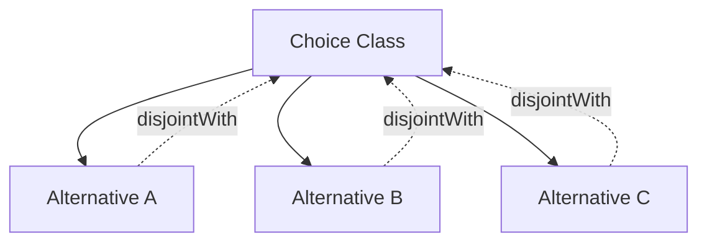
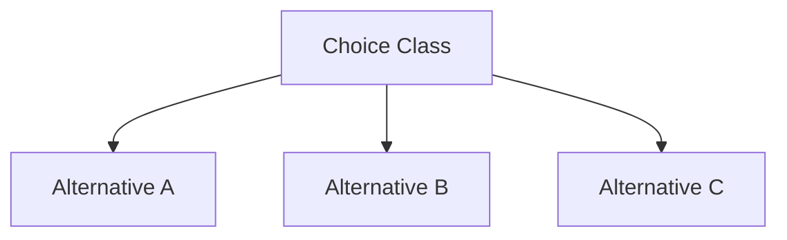

# Choice Patterns – Detailed Specification

This document provides a full explanation of **Choice semantics** in uml2semantics, including
exclusive and inclusive OR patterns, ISO 20022 lineage, OWL axioms, and Manchester syntax examples.

`ChoiceOf` and `ChoiceSemantics` allow UML-style “choice” constructs to be mapped deterministically
into OWL 2 logical structures.

---

# 1. Background and Purpose

Many domain models—especially ISO 20022, financial messaging, and metadata-driven schemas—use the concept of a **Choice**:
a node that represents *alternative structures*, only one of which may apply at a time.

uml2semantics models these Choice constructs faithfully using:

- **union classes**
- **disjointness axioms**
- **cardinality constraints**
- **controlled semantics** (exclusive / inclusive)

This ensures the resulting ontology reflects the intended business rules.

---

# 2. TSV Fields Controlling Choice Logic

Choice logic is sourced from **Classes.tsv**:

| Column | Meaning |
|--------|---------|
| **ChoiceOf** | Pipe-separated list of alternative class tokens or attribute tokens |
| **ChoiceSemantics** | `exclusive`, `inclusive`, or empty |

Example:

```
Curie    Name              ParentNames    ChoiceOf                                   ChoiceSemantics
iso:PartyIdChoice  PartyIdChoice      Identification   LEIId|BICId|ProprietaryId      exclusive
```

---

# 3. Exclusive OR Choice (XOR)

Exclusive OR means:

- **Exactly one** of the alternative structures is permitted at runtime.
- The choice class is a **subclass** of the union of the members.
- All members are **pairwise disjoint** with each other and with the choice class.

uml2semantics emits an `owl:AllDisjointClasses` set containing the choice class
and all choice members.

## 3.1 OWL Semantics

Mathematically:

```
Choice ⊑ (A ⊔ B ⊔ C)
AllDisjointClasses( Choice A B C )
```

## 3.2 Manchester OWL Syntax

```
Class: PartyIdChoice
    SubClassOf: LEIId or BICId or ProprietaryId

DisjointClasses: PartyIdChoice, LEIId, BICId, ProprietaryId
```

This ensures:

- A PartyIdChoice instance **must be** an instance of one of the alternatives.
- A PartyIdChoice instance **cannot simultaneously be** an instance of the choice itself and a concrete member, preventing recursive or self-referential classification.

---

# 4. Inclusive OR Choice (non-exclusive OR)

When `ChoiceSemantics` is set to **inclusive**, the alternatives express:
“A Choice may be realised by one or more of the members.”

uml2semantics interprets this as:

- The choice class is a **subclass** of the union of alternatives.
- **No disjointness statements are generated**.
- The model permits overlapping membership.

## 4.1 OWL Semantics

```
Choice ⊑ (A ⊔ B ⊔ C)
```

No disjoint axioms.

## 4.2 Manchester OWL Syntax

```
Class: TransactionPartyChoice
    SubClassOf: Originator or Intermediary or Beneficiary
```

No DisjointClasses block.

---

# 5. Empty ChoiceSemantics

If **ChoiceSemantics is empty**:

- The choice is treated as **inclusive OR**.
- Only the union axiom is emitted.
- No validation warnings are generated (this is a deliberate opt‑in model).

This behaviour matches UML association classes: absence of “XOR” implies “multiple allowed.”

---

# 6. Rationale for the Semantics

### 6.1 Why Exclusive OR?

Exclusive OR is used in:

- financial message definitions (ISO 20022)
- complex type choices
- protocol-level structures where only one form is valid
- patterns where overlapping members are explicitly prohibited

The exclusive semantics enforce a *strong design-time guarantee*.

### 6.2 Why Inclusive OR?

Inclusive choice is used when:

- multiple alternatives may co-exist
- the domain does not restrict overlapping structures
- the “choice” functions as a grouping abstraction rather than a constraint

This is common in metadata groups or logical OR constructs.

---

# 7. Property-Level Implications

Attributes whose range is a Choice class inherit its semantics:

## 7.1 Exclusive

```
Class: Account
  Facts:
    partyIdChoice value <some PartyIdChoice member>
```

Instances cannot validly use two different choice members.

## 7.2 Inclusive

Multiple values are allowed,
e.g. a metadata grouping field that may contain multiple forms of party description.

---

# 8. Detailed Mermaid Diagram of Choice Semantics



This diagram applies when **exclusive** is selected.

For inclusive semantics:



---

# 9. Full Manchester OWL Example – ISO-Style Choice

Given:

```
ChoiceOf = LEIId|BICId
ChoiceSemantics = exclusive
```

Generated OWL:

```
Class: PartyIdentifierChoice
    SubClassOf:
        LEIId or BICId

DisjointClasses:
    PartyIdentifierChoice,
    LEIId,
    BICId
```

---

# 10. TSV Example for a Realistic ISO 20022 Pattern

```
Curie    Name                        ParentNames   Definition    ChoiceOf                   ChoiceSemantics
iso:PtyIdChoice   PartyIdentificationChoice   Party    Identification   LEIId|BICId|OthrId   exclusive
```

The generator will emit:

- union axiom (as `rdfs:subClassOf` a union class)  
- `owl:AllDisjointClasses` for exclusive semantics  
- optional class annotations  
- standard prefix‑based IRIs  

---

# 11. Attribute Tokens as Choice Members

`ChoiceOf` members can also refer to attribute tokens (attribute Name or CURIE)
belonging to the choice class. In that case, the choice member is the **attribute
restriction** generated for that attribute, and the union is a union of
restriction nodes rather than only classes.

If a `ChoiceOf` member cannot be resolved to a class or an attribute on the
choice class, the converter logs a warning and skips that member.

---

# 12. Best Practices

- Always declare `exclusive` when mutually-exclusive business rules apply.  
- Leave `ChoiceSemantics` blank when inclusivity is intended.  
- Ensure all ChoiceOf members appear as class tokens or attribute tokens on the choice class.  
- Avoid deep nested choice constructs unless necessary.  
- Keep alternative class definitions disjoint when conceptually meaningful.  

---

# 13. Navigation

- Return to [[TSV-Specification]]  
- Go to [[Datatypes-and-Facets]]  
- Go to [[CLI-Usage]]  
- Back to [[Home]]
