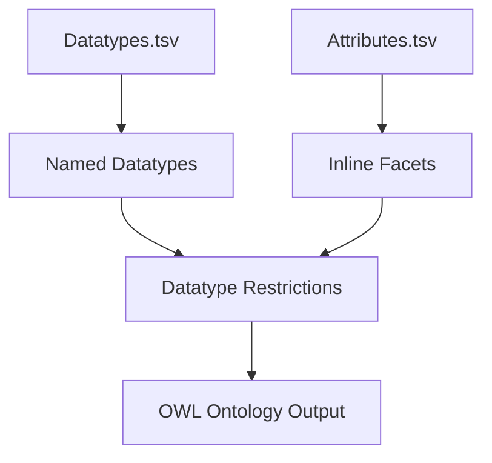

# Datatypes and Facets – Detailed Specification

This document provides a full explanation of **Named Datatypes**, **XSD datatype restrictions**, and **inline attribute-level facets** in `uml2semantics`.  
These features allow precise expression of lexical, syntactic, and numeric constraints directly from TSV inputs.

---

# 1. Overview

uml2semantics supports two parallel mechanisms for datatype constraints:

1. **Named Datatypes** defined in `Datatypes.tsv`  
2. **Inline facet restrictions** inside `Attributes.tsv`

Both approaches generate OWL 2 `DatatypeRestriction` constructs using XSD datatypes and facets.

---

# 2. Named Datatypes (Datatypes.tsv)

Named datatypes allow domain-specific restricted datatypes such as:

- LEI20 (Legal Entity Identifier – 20 chars)
- BIC11 (Bank Identifier Code – 11 chars)
- CurrencyAmount
- MonthYearDatatype (xsd:gYearMonth restricted)
- CountryCode (2-char ISO code)

These centralise constraints and avoid repetition across attributes.

---

# 3. Datatypes.tsv – Columns

| Column | Description |
|--------|-------------|
| **Curie** | CURIE for the datatype, e.g. `iso:LEI20` |
| **Name** | Human-readable label |
| **BaseDatatype** | Must be an XSD primitive (e.g. `xsd:string`, `xsd:integer`, `xsd:gYearMonth`) |
| **Definition** | Optional explanatory text |
| **Pattern** | Optional regex pattern |
| **MinLength** | Minimum string length |
| **MaxLength** | Maximum string length |
| **MinInclusive** | Numeric or lexical lower bound |
| **MaxInclusive** | Numeric or lexical upper bound |
| **MinExclusive** | Exclusive lower bound |
| **MaxExclusive** | Exclusive upper bound |
| **TotalDigits** | Total number of digits allowed |
| **FractionDigits** | Allowed number of decimal digits |

Any combination of facets may be used, as long as they are valid for the BaseDatatype.

---

# 4. Named Datatype Example

### Datatypes.tsv

```
Curie     Name     BaseDatatype  Pattern          MinLength  MaxLength
iso:LEI20 LEI20    xsd:string    [A-Z0-9]{20}     20         20
```

### Manchester Syntax Output

```
Datatype: LEI20
    EquivalentTo:
        xsd:string
            [ pattern "[A-Z0-9]{20}",
              minLength 20,
              maxLength 20 ]
```

### Turtle Output

```
iso:LEI20 a rdfs:Datatype ;
    owl:equivalentClass [
        a rdfs:Datatype ;
        owl:onDatatype xsd:string ;
        owl:withRestrictions (
            [ xsd:pattern "[A-Z0-9]{20}" ]
            [ xsd:minLength "20"^^xsd:integer ]
            [ xsd:maxLength "20"^^xsd:integer ]
        )
    ] .
```

---

# 5. Numeric Datatype Example

### Datatypes.tsv

```
Curie          Name                BaseDatatype   MinInclusive  MaxInclusive  FractionDigits
iso:Percent     PercentDatatype     xsd:decimal    0             100           2
```

### Manchester Syntax

```
Datatype: PercentDatatype
  EquivalentTo:
    xsd:decimal
      [ minInclusive 0,
        maxInclusive 100,
        fractionDigits 2 ]
```

---

# 6. gYearMonth Example (ISO 8601)

### Datatypes.tsv

```
Curie         Name            BaseDatatype     Pattern
iso:MonthYear MonthYearType   xsd:gYearMonth   [0-9]{4}-[0-9]{2}
```

This enforces a strict lexical structure such as `2024-09`.

---

# 7. Inline Facets in Attributes.tsv

Inline facets allow constraints to be specified directly in the attribute definition without creating a named datatype.
These inline restrictions are only emitted when the attribute range is an **XSD primitive** (e.g. `xsd:string`).

### Attributes.tsv Example

```
Class      Name         ClassEnumOrPrimitiveType  MinMultiplicity  MaxMultiplicity  MinLength  MaxLength  Pattern
Account    OwnerId      xsd:string                1                1                16         16         [A-Z0-9]+
```

Generates a property with a restricted datatype.

---

# 8. Inline Restriction Output (Manchester)

```
Datatype: xsd:string
    [ minLength 16,
      maxLength 16,
      pattern "[A-Z0-9]+" ]
```

And the property:

```
DataProperty: OwnerId
    Range: xsd:string[minLength 16, maxLength 16, pattern "[A-Z0-9]+"]
```

---

# 9. Combining Named Datatypes & Inline Facets

If an attribute targets a **named datatype** (from `Datatypes.tsv`), any inline
facet columns on that attribute are **ignored**. Inline facets only apply when
the attribute range is an `xsd:` primitive.

Example:

If you need an attribute-specific restriction, point the attribute at an
`xsd:` primitive and use inline facets, or create a separate named datatype.

---

# 10. Full Example – Multi‑Facet Restriction

### Attributes.tsv

```
Class   Name                 ClassEnumOrPrimitiveType  Pattern          MinLength  MaxLength  MinInclusive  MaxInclusive
Acct    OwnerTransactionId   xsd:string                [A-Z0-9]+(/[A-Z0-9]+)?  16  16  
```

### Manchester Syntax

```
DataProperty: OwnerTransactionId
    Range:
        xsd:string
            [ pattern "[A-Z0-9]+(/[A-Z0-9]+)?",
              minLength 16,
              maxLength 16 ]
```

---

# 11. Mermaid Diagram – Datatype Processing Workflow



---

# 12. Best Practices

- Prefer **Named Datatypes** when a constraint is reused.  
- Use inline facets for attribute-specific restrictions.  
- Ensure patterns are XML Schema–compatible.  
- Use `gYearMonth` for year-month environment fields.  
- Keep numeric constraints consistent with business vocabularies.  
- Avoid overlapping or contradictory restrictions.

---

# 13. Errors You Might See

- Named datatypes with facet columns **must** specify `BaseDatatype`.
  If facets are present and `BaseDatatype` is empty, the converter raises an error
  instead of defaulting to `xsd:string`.

---

# 14. Navigation

- Return to [[TSV-Specification]]  
- Go to [[Choice-Patterns]]  
- Go to [[CLI-Usage]]  
- Back to [[Home]]
