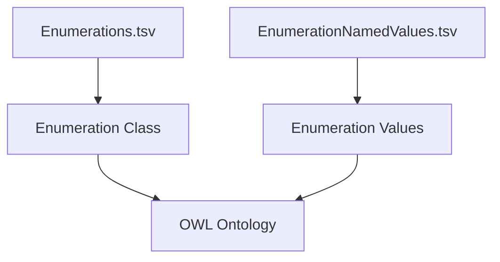

# Enumerations – Detailed Specification

This document provides a comprehensive explanation of **enumeration classes**, **enumeration individuals**, and how `uml2semantics` models ISO-style code lists (e.g. ISO 4217 currency codes) using OWL 2 constructs.

Enumerations are fundamental when modelling controlled vocabularies, regulated identifiers, or closed sets of named values.

---

# 1. Overview

uml2semantics uses two TSV files to define enumeration structures:

1. **Enumerations.tsv** – declares enumeration *classes*  
2. **EnumerationNamedValues.tsv** – declares enumeration *individuals*  

This separation mirrors ISO 20022’s separation between:

- the *enumeration class* (e.g., “CurrencyCode”) and  
- its *values* (e.g., GBP, EUR, JPY)

---

# 2. Enumerations.tsv – Enumeration Classes

An enumeration class is a standard OWL class representing the “type” of a controlled vocabulary.

## 2.1 Required Columns

| Column | Description |
|--------|-------------|
| **Curie** | CURIE for the enumeration class, e.g. `iso:CurrencyCode` |
| **Name** | Human-readable class name |
| **Definition** | Optional natural language definition |

### Example

```
Curie                Name           Definition
iso:CurrencyCode     CurrencyCode   ISO 4217 currency codes
```

### OWL Manchester Syntax

```
Class: CurrencyCode
    Annotations:
        rdfs:label "CurrencyCode"
```

This class acts as the domain for all enumeration individuals.

---

# 3. EnumerationNamedValues.tsv – Enumeration Individuals

Defines the actual values belonging to the enumeration class.

## 3.1 Required Columns

| Column | Description |
|--------|-------------|
| **Enumeration** | Name of enumeration class (must match Enumerations.tsv “Name” or CURIE local part) |
| **Curie** | CURIE of the individual value |
| **Name** | Human-readable label, typically code value |
| **Definition** | Optional text |

### Example

```
Enumeration      Curie        Name    Definition
CurrencyCode     iso:GBP      GBP     Pound Sterling
CurrencyCode     iso:EUR      EUR     Euro
CurrencyCode     iso:JPY      JPY     Japanese Yen
```

### OWL Manchester Syntax

```
Individual: GBP
    Types: CurrencyCode
    Annotations:
        rdfs:label "GBP"
```

---

# 4. ISO 4217 Example (Full Walkthrough)

### Enumerations.tsv

```
Curie                Name           Definition
iso:CurrencyCode     CurrencyCode   ISO 4217 currency codes
```

### EnumerationNamedValues.tsv

```
Enumeration      Curie        Name    Definition
CurrencyCode     iso:GBP      GBP     Pound Sterling
CurrencyCode     iso:EUR      EUR     Euro
CurrencyCode     iso:USD      USD     US Dollar
CurrencyCode     iso:JPY      JPY     Japanese Yen
CurrencyCode     iso:CHF      CHF     Swiss Franc
```

### OWL Manchester Syntax Output

```
Class: CurrencyCode

Individual: GBP
    Types: CurrencyCode

Individual: EUR
    Types: CurrencyCode

Individual: USD
    Types: CurrencyCode

Individual: JPY
    Types: CurrencyCode

Individual: CHF
    Types: CurrencyCode
```

### Turtle Output

```
iso:GBP a iso:CurrencyCode ;
    rdfs:label "GBP" ;
    skos:prefLabel "Pound Sterling"@en .

iso:EUR a iso:CurrencyCode ;
    rdfs:label "EUR" ;
    skos:prefLabel "Euro"@en .
```

---

# 5. Relationship Between TSVs and OWL Structures

Enumerations modelled in TSV become OWL:

- enumeration class → `owl:Class`
- enumeration entries → `owl:NamedIndividual`
- each individual has a `rdf:type` relationship to the enumeration class

The generator **does not** automatically create:
- `owl:oneOf` axioms  
- closed class restrictions  
- disjointness between individuals  

These can be added manually via additional TSV columns in future extensions.

---

# 6. Enumeration as Property Ranges

Enumerations may be used as attribute ranges in **Attributes.tsv**.

### Example

```
Class      Name        ClassEnumOrPrimitiveType  MinMultiplicity  MaxMultiplicity
Account    Ccy         CurrencyCode              1                1
```

### Manchester Syntax

```
DataProperty: Ccy
    Range: CurrencyCode
```

Any individual of type `CurrencyCode` is valid.

---

# 7. Mermaid Diagram – Enumeration Workflow



---

# 8. Best Practices

- Use enumeration classes for any controlled vocabulary.  
- Use clear, uppercase code values (GBP, EUR, JPY).  
- Provide definitions where possible.  
- Use annotation properties such as `skos:prefLabel` for human-friendly labels.  
- Keep enumeration TSVs alphabetised for stability.  
- Use CURIEs consistently (`iso:GBP`, not bare `GBP`).  

---

# 9. Navigation

- Return to [[TSV-Specification]]  
- Continue to [[Datatypes-and-Facets]]  
- Continue to [[Annotations]]  
- Back to [[Home]]

