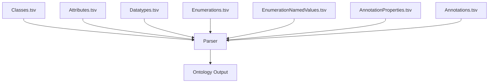

# Examples – Detailed End‑to‑End Demonstrations

This page provides **complete practical examples** showing how TSV inputs are transformed into OWL 2 ontologies using `uml2semantics`.  
Each example illustrates:

- the TSV inputs  
- expected ontology output (Manchester + Turtle)  
- modelling rationale  
- SHACL considerations  
- typical CLI invocation  

These examples form the basis for the *golden tests* and are designed for reproducibility.

---

# 1. Example 1 – Minimal Class + Attribute Model

This example demonstrates the smallest possible ontology generated from TSV inputs.

## 1.1 Classes.tsv

```
Curie      Name        ParentNames   Definition
ex:Account Account                   A financial account.
```

## 1.2 Attributes.tsv

```
Class     Name      ClassEnumOrPrimitiveType  MinMultiplicity  MaxMultiplicity  Definition
Account   Id        xsd:string                1                1                Account identifier.
```

## 1.3 Ontology Output (Manchester Syntax)

```
Class: Account
    Annotations: rdfs:label "Account"

DataProperty: Id
    Domain: Account
    Range: xsd:string
```

## 1.4 CLI Command

```
uml2semantics -c Classes.tsv -a Attributes.tsv -o out.ttl -i http://example.org/ns
```

---

# 2. Example 2 – Datatype Restrictions with Inline Facets

## 2.1 Attributes.tsv

```
Class     Name        ClassEnumOrPrimitiveType  MinMultiplicity  MaxMultiplicity  MinLength  MaxLength  Pattern
Account   OwnerId     xsd:string                1                1                16         16         [A-Z0-9]+
```

## 2.2 Output

```
DataProperty: OwnerId
    Domain: Account
    Range:
        xsd:string
            [ minLength 16,
              maxLength 16,
              pattern "[A-Z0-9]+" ]
```

---

# 3. Example 3 – Named Datatypes (LEI20)

## 3.1 Datatypes.tsv

```
Curie     Name     BaseDatatype  Pattern          MinLength  MaxLength
iso:LEI20 LEI20    xsd:string    [A-Z0-9]{20}     20         20
```

## 3.2 Attributes.tsv using Named Datatype

```
Class     Name        ClassEnumOrPrimitiveType  MinMultiplicity  MaxMultiplicity
Account   LeiId       LEI20                     0                1
```

## 3.3 Output (Manchester)

```
Datatype: LEI20
    EquivalentTo:
        xsd:string
            [ pattern "[A-Z0-9]{20}",
              minLength 20,
              maxLength 20 ]

DataProperty: LeiId
    Domain: Account
    Range: LEI20
```

---

# 4. Example 4 – Enumeration Class and ISO 4217 Individuals

## 4.1 Enumerations.tsv

```
Curie            Name
iso:CurrencyCode CurrencyCode
```

## 4.2 EnumerationNamedValues.tsv

```
Enumeration     Curie       Name    Definition
CurrencyCode    iso:GBP     GBP     Pound Sterling
CurrencyCode    iso:EUR     EUR     Euro
CurrencyCode    iso:USD     USD     US Dollar
```

## 4.3 Attributes.tsv

```
Class     Name   ClassEnumOrPrimitiveType  MinMultiplicity  MaxMultiplicity
Account   Ccy    CurrencyCode              1                1
```

## 4.4 OWL Output (Manchester)

```
Class: CurrencyCode

Individual: GBP
    Types: CurrencyCode

Individual: EUR
    Types: CurrencyCode

Individual: USD
    Types: CurrencyCode

DataProperty: Ccy
    Range: CurrencyCode
```

---

# 5. Example 5 – ISO‑Style Exclusive Choice

## 5.1 Classes.tsv

```
Curie    Name            ChoiceOf               ChoiceSemantics
ex:PtyIdChoice  PartyIdentifierChoice   LEIId|BICId   exclusive
ex:LEIId        LEIId
ex:BICId        BICId
```

## 5.2 Output (Manchester Syntax)

```
Class: PartyIdentifierChoice
    SubClassOf: LEIId or BICId

DisjointClasses:
    PartyIdentifierChoice, LEIId

DisjointClasses:
    PartyIdentifierChoice, BICId
```

---

# 6. Example 6 – Full Mixed Model

This example shows all TSV types working together.

### Classes.tsv

```
Curie        Name                 ParentNames
ex:Account   Account
ex:Holder    Holder
ex:PtyChoice PartyChoice          LEIId|BICId   exclusive
```

### Attributes.tsv

```
Class     Name      ClassEnumOrPrimitiveType  MinMultiplicity  MaxMultiplicity
Account   Id        xsd:string                1                1
Account   Ccy       CurrencyCode              1                1
Account   Party     PartyChoice               0                1
Holder    Name      xsd:string                1                1
```

### Datatypes.tsv

```
Curie     Name     BaseDatatype  Pattern           MinLength  MaxLength
iso:LEI20 LEI20    xsd:string    [A-Z0-9]{20}      20         20
```

### Enumerations.tsv

```
Curie            Name
iso:CurrencyCode CurrencyCode
```

### EnumerationNamedValues.tsv

```
Enumeration     Curie      Name
CurrencyCode    iso:GBP    GBP
CurrencyCode    iso:EUR    EUR
```

### AnnotationProperties.tsv

```
Curie       Name       Definition
dct:source  Source     Origin of the element
```

### Annotations.tsv

```
TargetCurie    AnnotationProperty   Value
ex:Account     dct:source           "Imported from ISO 20022"
```

---

# 7. Expected Full Output (Manchester Extracts)

```
Class: Account
    SubClassOf:
        Id exactly 1 xsd:string,
        Ccy exactly 1 CurrencyCode,
        Party max 1 PartyChoice

Class: PartyChoice
    SubClassOf: LEIId or BICId
    DisjointClasses: PartyChoice, LEIId
    DisjointClasses: PartyChoice, BICId

Individual: GBP
    Types: CurrencyCode
```

---

# 8. Mermaid Diagram – Example Pipeline



---

# 9. How to Reproduce All Examples

Use:

```
uml2semantics   -c Classes.tsv   -a Attributes.tsv   --datatypes Datatypes.tsv   --enumerations Enumerations.tsv   --enum-values EnumerationNamedValues.tsv   --annotation-properties AnnotationProperties.tsv   --annotations Annotations.tsv   -o out.ttl   -i http://example.org/ns   -p "ex:http://example.org/ns#,dct:http://purl.org/dc/terms#"
```

---

# 10. Navigation

- Back to [[TSV-Specification]]  
- Continue to [[Golden-Tests]]  
- Return to [[Home]]

