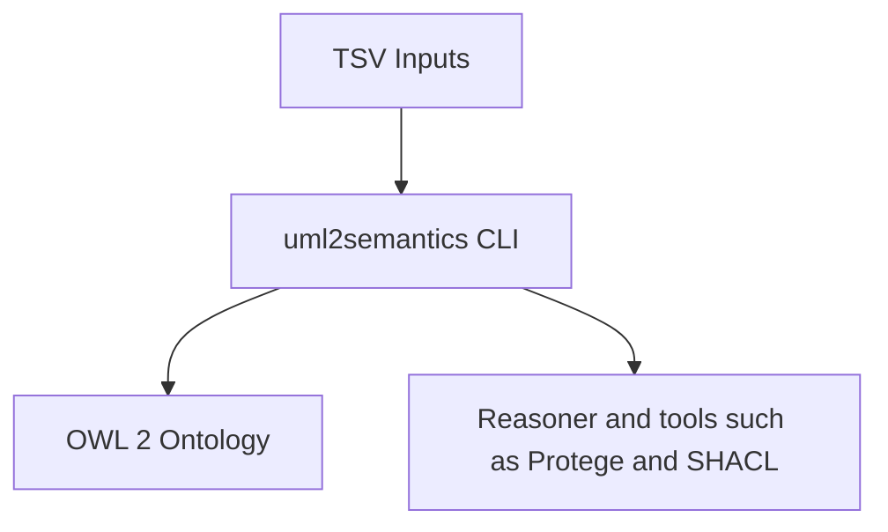

# uml2semantics – Wiki Home

Welcome to the **uml2semantics** project wiki.

## Wiki Contents
- [[Getting-Started]]
- [[TSV-Specification]]
- [[Choice-Patterns]]
- [[Datatypes-and-Facets]]
- [[Enumerations]]
- [[Annotations]]
- [[CLI-Usage]]
- [[Architecture]]
- [[Examples]]
- [[Troubleshooting]]
- [[Golden-Tests]]
