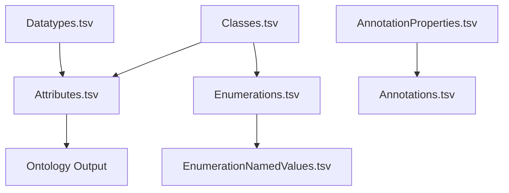

# TSV Specification – Full Detailed Reference

This document provides a **complete technical specification** of all TSV files used by **uml2semantics**.  
Each TSV controls part of the UML → OWL2 transformation pipeline.  
All files must be UTF-8 encoded, tab‑separated, and include headers.

---

# 1. Overview of the TSV Ecosystem

uml2semantics loads the following TSV files:

1. **Classes.tsv**  
2. **Enumerations.tsv** *(optional)*  
3. **EnumerationNamedValues.tsv** *(optional)*  
4. **Datatypes.tsv** *(optional)*  
5. **Attributes.tsv**  
6. **AnnotationProperties.tsv** *(optional)*  
7. **Annotations.tsv** *(optional)*  

Resolution and validation happen during ontology build; classes, datatypes, and
enumerations must exist before attributes and annotations can reference them.

---

# 2. Classes.tsv – Class Declarations and ISO 20022 Choice Patterns

Defines all OWL classes in the model, including inheritance and exclusive choice logic.

## 2.1 Required Columns

| Column | Description |
|--------|-------------|
| **Curie** | Short IRI prefix plus local name, e.g. `iso:Account` |
| **Name** | Human-readable class label |
| **ParentNames** | Pipe-separated list of superclasses; empty means `owl:Thing` |
| **Definition** | Optional natural language description |
| **ChoiceOf** | Pipe-separated list of alternative class tokens or attribute tokens |
| **ChoiceSemantics** | Allowed values: `exclusive`, `inclusive`, or blank |

## 2.2 Choice Logic Interpretation

### When *ChoiceOf* is populated:

- `ChoiceClass ⊑ ChoiceOptionA ⊔ ChoiceOptionB ⊔ ...`
- If `ChoiceSemantics = exclusive`:
  - The choice class and members are **pairwise disjoint** (via `owl:AllDisjointClasses`)
- If `ChoiceSemantics` is empty:
  - No exclusivity constraints are applied

### Example Row

```
Curie    Name              ParentNames  Definition      ChoiceOf                               ChoiceSemantics
iso:QtyChoice  Quantity6Choice   Amount    ISO pattern    FinInstrmQtyChoice|OrigAndCurrQty      exclusive
```

---

# 3. Attributes.tsv – Object & Datatype Properties, Multiplicities, Facets

Defines UML attributes mapped to OWL object or datatype properties.

## 3.1 Required Columns

| Column | Description |
|--------|-------------|
| **Class** | The class owning this attribute |
| **Curie** | Optional explicit property CURIE |
| **Name** | Property name; becomes rdfs:label and local name |
| **ClassEnumOrPrimitiveType** | Range: class, enumeration, or XSD datatype |
| **MinMultiplicity** | 0, 1, or n |
| **MaxMultiplicity** | 1, n, or `*` for unbounded |
| **Definition** | Optional natural-language description |

## 3.2 Facet Columns (inline datatype restrictions)

These generate `owl:DatatypeRestriction`:

| Facet Column | Description |
|--------------|-------------|
| **Pattern** | regex string (must be XML Schema compliant) |
| **MinLength** | minimum string length |
| **MaxLength** | maximum string length |
| **MinInclusive** | minimum numeric value |
| **MaxInclusive** | maximum numeric value |
| **MinExclusive** | exclusive numeric lower bound |
| **MaxExclusive** | exclusive numeric upper bound |
| **TotalDigits** | total digits allowed |
| **FractionDigits** | decimal fractional digits |

### Example Inline Facet Attribute

```
Class    Name         ClassEnumOrPrimitiveType  MinMultiplicity  MaxMultiplicity  Pattern  MinLength  MaxLength
Account  OwnerId      xsd:string                1                1                [A-Z0-9]+  16         16
```

Produces:

```
OwnerId ⊑ DatatypeRestriction( xsd:string xsd:minLength "16"^^xsd:int xsd:maxLength "16"^^xsd:int )
```

---

# 4. Datatypes.tsv – Named Datatypes with Facet Restrictions

Defines reusable datatype restrictions.

## 4.1 Required Columns

| Column | Description |
|--------|-------------|
| **Curie** | Named datatype CURIE |
| **Name** | Human-readable name |
| **BaseDatatype** | Must be an XSD type (e.g. xsd:string) |
| **Definition** | Optional description |

## 4.2 Facet Columns
Same as in Attributes.tsv.

| Facet Column | Description |
|--------------|-------------|
| **Pattern** | regex string (must be XML Schema compliant) |
| **MinLength** | minimum string length |
| **MaxLength** | maximum string length |
| **MinInclusive** | minimum numeric value |
| **MaxInclusive** | maximum numeric value |
| **MinExclusive** | exclusive numeric lower bound |
| **MaxExclusive** | exclusive numeric upper bound |
| **TotalDigits** | total digits allowed |
| **FractionDigits** | decimal fractional digits |

### Example

```
Curie   Name     BaseDatatype  Pattern        MinLength  MaxLength
iso:LEI LEI20    xsd:string    [A-Z0-9]{20}   20         20
```

Generates:

```
Datatype: LEI20
  EquivalentTo: 
    xsd:string[pattern "[A-Z0-9]{20}", minLength 20, maxLength 20]
```

---

# 5. Enumerations.tsv – Enumeration Classes

Defines OWL classes whose instances are individuals declared in EnumerationNamedValues.tsv.

### Columns

| Column | Description |
|--------|-------------|
| **Curie** | Enumeration class CURIE |
| **Name** | e.g. CurrencyCode |
| **Definition** | Optional description |

---

# 6. EnumerationNamedValues.tsv – Enumeration Individuals

Defines actual named values.

### Columns

| Column | Description |
|--------|-------------|
| **Enumeration** | Must match a class declared in Enumerations.tsv |
| **Curie** | Individual CURIE |
| **Name** | Human-readable token |
| **Definition** | Optional definition |

#### Example

```
Enumeration   Curie    Name   Definition
CurrencyCode  iso:GBP  GBP    Pound Sterling
```

Generates:

```
Individual: GBP
  Types: CurrencyCode
```

---

# 7. AnnotationProperties.tsv – Annotation Vocabulary

Defines custom annotation properties.

### Columns

| Column | Description |
|--------|-------------|
| **Curie** | Annotation property CURIE |
| **Name** | Label |
| **Definition** | Description |

---

# 8. Annotations.tsv – Annotation Assertions

Assigns metadata to classes, properties, datatypes, individuals.

### Columns

| Column | Description |
|--------|-------------|
| **TargetCurie** | Entity being annotated |
| **AnnotationProperty** | CURIE of annotation property |
| **Value** | Literal or IRI |
| **Language** | Optional language tag |
| **Datatype** | Optional datatype CURIE |

### Example

```
iso:Account  rdfs:label  "Account Details"  en  xsd:string
```

---

# 9. Validation Rules (Implemented)

- Missing or duplicate identifiers (CURIE/Name) for classes, enumerations,
  datatypes, attributes, and annotation properties raise errors.  
- Attribute multiplicities must be non-negative and consistent (min ≤ max).  
- Attribute types must resolve to a class, enumeration, named datatype, or
  `xsd:` primitive.  
- Prefixes used in CURIEs must be declared; missing prefixes are logged as warnings.  
- Choice members that do not resolve to a class or attribute are logged as warnings.  

Additional constraints (e.g. regex validity, numeric facet ranges) are
recommended but are not currently enforced by the converter.

---

# 10. Relationship Between TSV Files



---

# 11. Next Steps

Continue to:
- [[Choice-Patterns]] for exclusive union modelling  
- [[Datatypes-and-Facets]] for datatype restriction logic  
- [[CLI-Usage]] for full command reference  

Return to [[Home]].
