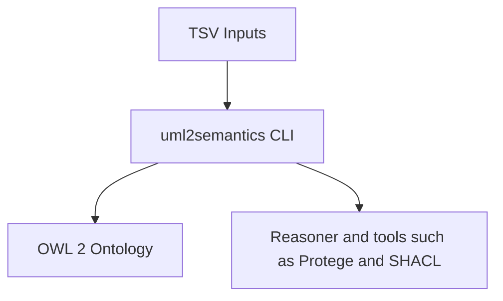

# uml2semantics – Wiki Home

Welcome to the **uml2semantics** project wiki.

## Wiki Contents
- [Getting Started](Getting-Started.md)
- [TSV Specification](TSV-Specification.md)
- [Choice Patterns](Choice-Patterns.md)
- [Datatypes and Facets](Datatypes-and-Facets.md)
- [Enumerations](Enumerations.md)
- [Annotations](Annotations.md)
- [CLI Usage](CLI-Usage.md)
- [Architecture](Architecture.md)
- [Examples](Examples.md)
- [Troubleshooting](Troubleshooting.md)
- [Golden Tests](Golden-Tests.md)
